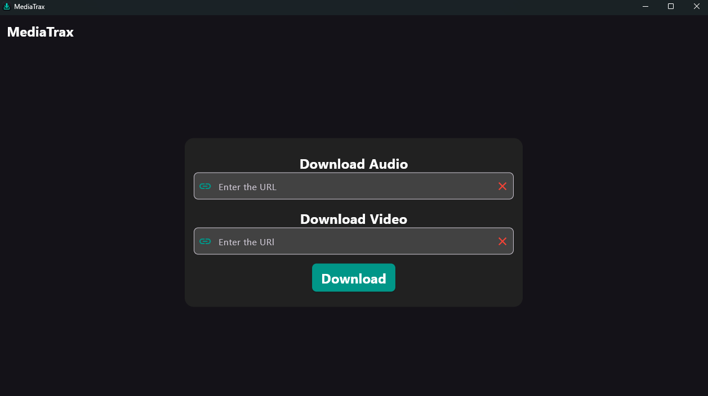
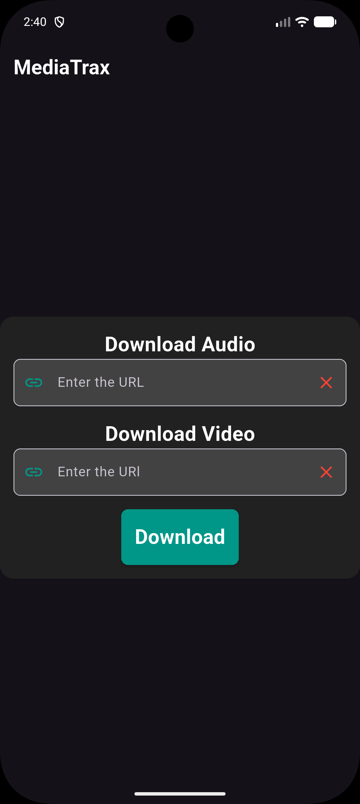

# MediaTrax 🎬🎵

**MediaTrax** is a cross-platform application designed to download video and audio from URLs quickly and intuitively. The project includes a **Windows (Desktop)** version and an **Android (Mobile)** version.

<p align="center">
 
  
  
  
  <br />
  
  
  
  
</p>

---

## 📥 Download MediaTrax

Select your operating system to download the latest version:

| Platform | Download | Version | Status |
| :--- | :---: | :---: | :---: |
| 🪟 **Windows** | [](https://github.com/DarleyArcaya/Media-Trax/releases/download/v2026.8.0/MediaTrax_Setup.exe) | `v2026.08.0` | `Pre-release` |
| 🤖 **Android** | [](https://github.com/DarleyArcaya/Media-Trax/releases/download/v2026.8.0/mediatrax.apk) | `v2026.08.0` | `Pre-release` |

---

## 📱 Screenshots

<p align="center" style="display: flex; align-items: center; justify-content: center; gap: 20px;">
  
  
</p>
## 🛠️ Project Architecture

The repository is organized within the `src/` folder as follows:

```text
Media-Trax/
├── src/
│   ├── desktope code version/
│   │   ├── api/       # Python Backend API (FastAPI / PyInstaller)
│   │   └── client/    # Desktop Client (Flutter)
│   └── mobile code version/
│       └── mediatrax/ # Native/Cross-platform Mobile App (Flutter)
└── README.md
```

* **Desktop Version:** Combines a lightweight **Python** backend that handles content extraction/downloads with a modern and interactive graphical interface built with **Flutter**.
* **Mobile Version:** A native **Flutter** application optimized for Android devices.

---

## ✨ Features

* 📹 **Video and Audio Downloads:** Extract audiovisual content in high quality directly from web links.
* 💻 **Windows Support:** Fast client-server interface.
* 📱 **Android Support:** Smooth experience optimized for touchscreens.
* 🎨 **Modern Interface:** Clean and intuitive design built with Flutter.

---

## 🚀 Requirements & Installation

### Prerequisites

* **Flutter SDK** (v3.x or higher)
* **Python** (v3.10+ for the Desktop API environment)
* **Git**

---

### 🏃‍♂️ Running in Development

#### 1. Desktop Version

**Backend (Python API):**

```bash
cd "src/desktope code version/api"
pip install -r requirements.txt  # Install dependencies
python main.py                   # Start local server
```

**Client (Flutter Desktop):**

```bash
cd "src/desktope code version/client"
flutter pub get
flutter run -d windows
```

#### 2. Mobile Version (Android)

Connect your Android device or start an emulator:

```bash
cd "src/mobile code version/mediatrax"
flutter pub get
flutter run
```

---

## 📄 License

This project is distributed under the **Apache-2.0** license.
